# DigCre_Project

This is the readme file for a project in the module **Digital Creativity** at Lucerne University of Applied Sciences and Arts. The goal of this project is to visualize piano learning progress using AI-generated images based on MIDI data captured from piano practice sessions. 

---
## Note on Audio
The audio files for each run were recorded and are stored in their respective folders. Unfortunately, I have not found a way to make them playable directly within the browser.

## Idea

This project uses MIDI data recorded during piano practice to create visual representations of learning progress. The data captured from the MIDI is used to define unique prompts based on what was played. To capture the "process," each run of playing the same song is split into defined sections. This is because, as a beginner, I tend to restart the song if I make a mistake. 

The more sections I play in a run, the more familiar I am with the song. It’s important to note that this idea is not meant to measure the quality of piano playing but rather the progress of learning the song. The song can be played completely wrong—as long as more notes are pressed, it still counts as "progress."

  

---

## Implementation

The project implementation involves capturing MIDI data from a keyboard, processing the data for visualization, and using an AI model to create the images. The e-piano or keyboard if first conntected to a computer via a midi cable. A python script will capture the midi data and transform the information into a readable promt for an AI model. The model i accessed via hugging face and passed the prompt. The AI then gives back the generated image. 

### Segmenting the Data 

The function "segment_midi_data" from the [midi_extract.py](Python%20Code/Prototype/midi_extract.py) segments MIDI data into smaller sections, each containing a specified number of notes (default is 8 in the prototype). It processes the input list of notes, where each note has pitch, velocity, and timestamp values. For each section, it collects notes until it reaches the specified size or the end of the input. Once a section is complete, it calculates features like pitch range, average velocity, tempo, rhythm complexity, note density, and the dominant octave based on the collected notes. These features provide insights into the musical structure of each section. After calculating the features, the section is stored, and the process repeats for the remaining notes until all data is processed.

This can be changed depending on the desired number of generated pictures and the amount of notes in a song. 

### Defining Prompts 

The function "generate_prompt" from the [prompt_generator.py](Python%20Code/Prototype/prompt_generator.py) generates a descriptive prompt for visualizing MIDI data based on the musical features extracted from a segment. It analyzes the tempo, velocity, pitch, and rhythmic complexity to determine mood, intensity, color schemes, and textures.

The tempo defines whether the mood is calm, balanced, or energetic. Velocity influences color intensity, with softer velocities leading to pastel tones and higher velocities producing bolder colors. The average pitch selects the dominant color scheme, transitioning from cool blues to warm yellows as pitch increases. Finally, rhythmic complexity determines the texture—simpler patterns for low complexity and intricate designs for higher values.

### Generating the Image 
The file [image_generator.py](Python%20Code/Prototype/image_generator.py) defines a function, generate_image, that sends a text prompt to the HuggingFace API for generating an image using the Stable Diffusion model. The function handles retries and errors, ensuring robustness against temporary unavailability of the model.

It sends a POST request to the API with the provided prompt and authorization header. If the request is successful, the image is processed directly from the response content and saved with the given filename.

If the API responds with a 503 status code, indicating that the model is still loading, the function waits for 60 seconds before retrying, allowing the server time to become available. It retries up to 5 times before giving up.

### Capturing Audio

The file [sound_capture.py](Python%20Code/Prototype/sound_capture.py) records audio from the microphone for a given duration and saves it as a WAV file. It uses the sounddevice library to capture mono audio at a specified sample rate, then writes the data to a 16-bit WAV file. This is mainly done to present it in a project later, it is not a necessary step. 

### Main Script 

The main function orchestrates the simultaneous capture of audio and MIDI data, then processes the MIDI data to generate images based on extracted musical features.

First, it ensures the specified output folder exists, creating it if necessary. It then initializes a stop flag to control when MIDI data capture should stop and defines an empty list to store captured MIDI notes.

Two threads are created—one for recording audio and another for capturing MIDI data. The audio thread records audio for a fixed duration (default 15 seconds) and saves it as a WAV file. Meanwhile, the MIDI thread extracts MIDI features until the stop flag is set, which happens after the audio thread completes.

Once both threads finish, the function checks whether MIDI data was captured. If it was, it segments the data into sections, generates prompts for each section, and uses these prompts to create corresponding images, saving them in the output folder.

---

## Protype Iteration

A preliminary prototype was developed before the interim presentation of this module, primarily serving as a technical proof of concept to evaluate the feasibility of the idea. Following this, a more refined and functional prototype was created, incorporating the implementation previously described.

The first test run of the prototype was conducted using the song "Can't Help Falling in Love" by Elvis Presley.

The prompt was: A balanced and reflective scene with vibrant colors with medium contrast, featuring green and teal hues reflecting the notes 73 and 60 and smooth and minimal textures.

  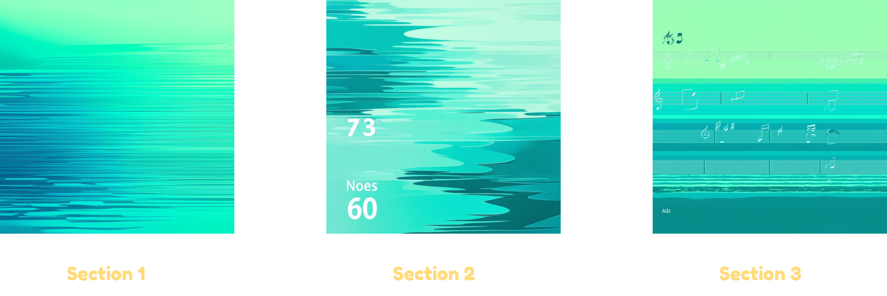

Since the AI model included the notes in the image, the mentioning of specific notes was deleted. 

  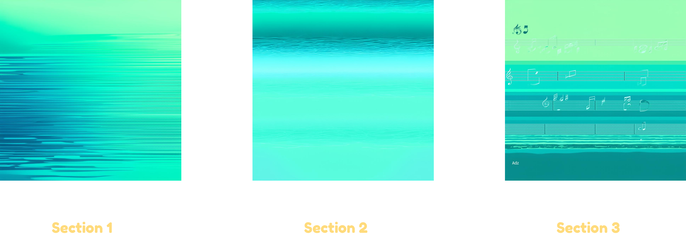

This resulted in a better outcome, however the "note" was still visible in a way it shouldn't be. 
The solve this the promt was completely altered to just include the color names. 
To also be able to better distinct the sections i thought it was a great idea to assign a specific color to each note using hex codes. 

  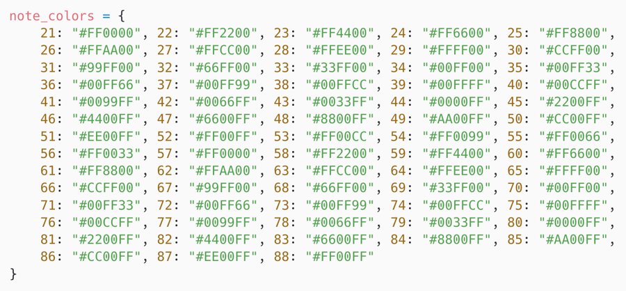

As you are probably guessing now this resulted in the AI printing the HEX Codes. 

  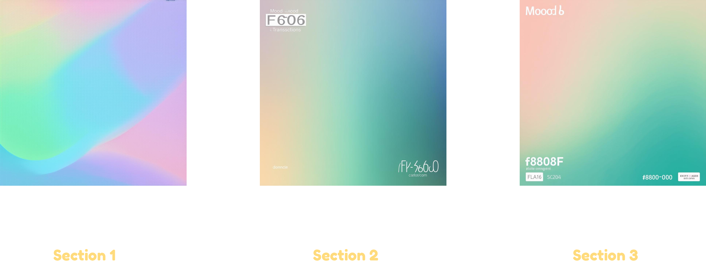

To solve this the names were written with the proper names. 

  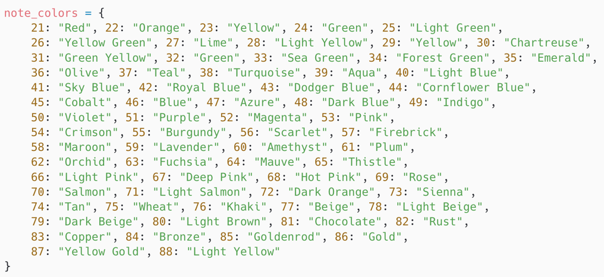

This led to the desired outcome.

  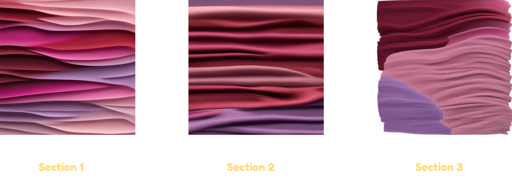

---
## Prompt definition update 

The prompt generator function was updated to detect more subtle changes within the song.

This updated prompt generator introduces several enhancements to produce more detailed and expressive visual descriptions based on MIDI features. It expands mood categories to cover a wider range of tempos, from calm and meditative to intense and overwhelming, offering more nuanced interpretations of musical tempo. The intensity descriptions are improved, providing vivid imagery such as pastel tones, balanced contrasts, or sharp transitions based on velocity. A manual mapping of MIDI notes to specific colors has been added, assigning colors to pitches between 21 and 88, allowing the pitch range to contribute dynamically to the color scheme. Textures vary based on rhythmic complexity, ranging from smooth and flowing lines to chaotic fractals, while visual density descriptions reflect note density, adding minimalist, balanced, or densely overlapping forms. Pitch transitions are described using smooth gradients, hue shifts, or vivid spectrums, depending on the size of the pitch range.

## Real Iteration 

For the first real iteration the song "Set Fire to the Rain" by Adele (one of my absolute favourite artists) was chosen. 

The first run had the expexted outcome: 

 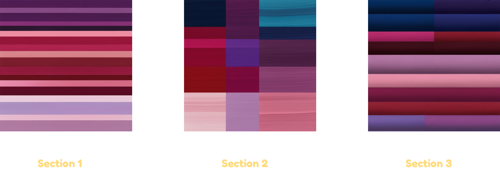 
 
 

  <a href="SetFireToTheRain/setfiretotherain_1/captured_audio.wav">Audio</a>

The second run went much better resulting in a number of generated images. To lower this number the size of the sections was increased for further runs. 

 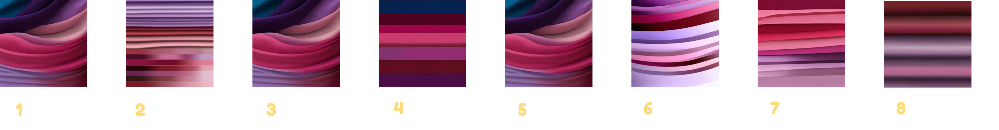 
 
 

  <a href="SetFireToTheRain/setfiretotherain_2/captured_audio.wav">Audio</a>

The song was then played a number of times. The respectives run can be seen in the folder [SetFireToTheRain](SetFireToTheRain/) for run 1 - 7. 

An example includes the images generated in run 4: 

 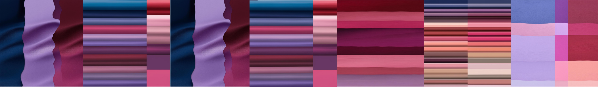 
 
 

  <a href="SetFireToTheRain/setfiretotherain_4/captured_audio.wav">Audio</a>

### Include Lyrics 
Since this approach worked well, I also wanted to incorporate the lyrics of the song into the prompt, allowing the AI to reflect their essence in the image — figuratively, not literally.

First i just added the lyrics at the bottom of the prompt. This was not taken into account when the image was generated and while the last images lookes slightly different, the lyrics were not represented. 

 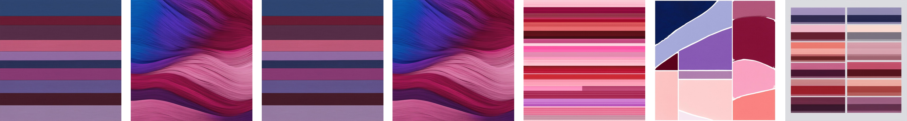 
 
 

  <a href="SetFireToTheRain/setfiretotherain_8/captured_audio.wav">Audio</a>

The lyrics were then condensed to just the opening lines of the song. The goal was to integrate the lyrics into the corresponding sections, ensuring each prompt reflected the mood and meaning of the lyrics for that part. This did also not work how i expected, since i wanted the original picture just so much altered that it reflected the lyrics. Not have the lyrics printed on there. 

 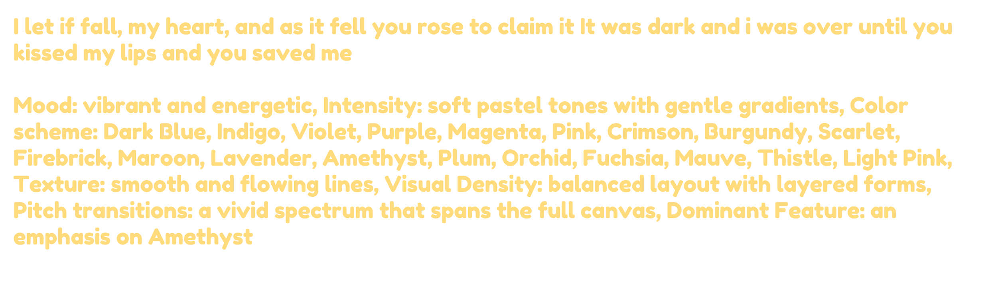 
 
 

 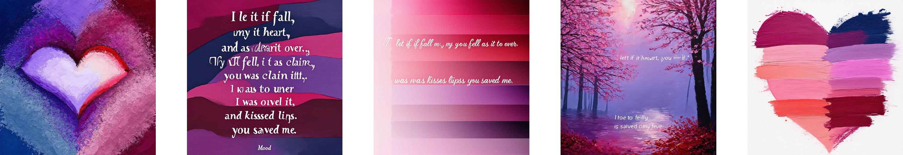 
 
 

In run 10, I simply added the title of the song at the beginning, hoping it would achieve the desired effect.
It did not. 

 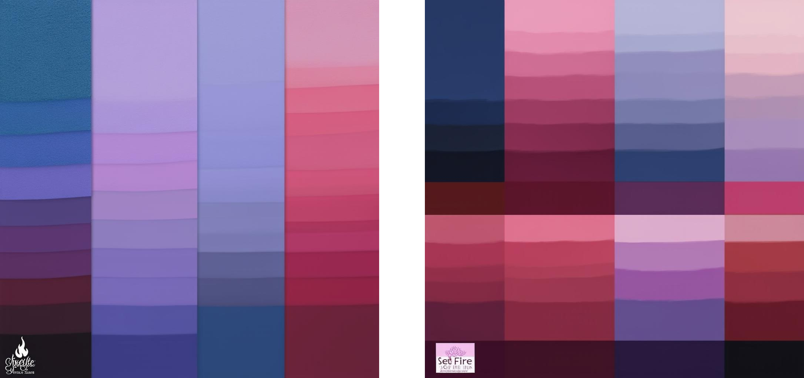 
 
 

  <a href="SetFireToTheRain/setfiretotherain_9/captured_audio.wav">Audio</a>

Then i put it like this at the beginning: "Visualize a scene with the context of SET FIRE TO THE RAIN with the following features". 
Oddly enought this resulted in images as in the first few runs where the context of lyrics was not added. 

 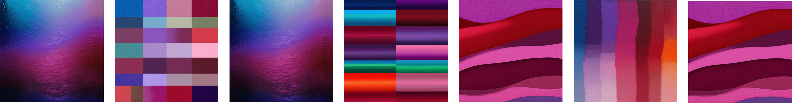 
 
 

  <a href="SetFireToTheRain/setfiretotherain_9/captured_audio.wav">Audio</a>

### Artstyles 
I then experimented with different well-known art styles, such as Art Nouveau and Van Gogh. This approach worked surprisingly well—or at least came the closest to incorporating the lyrics into the images.

Art Nouveau: 

 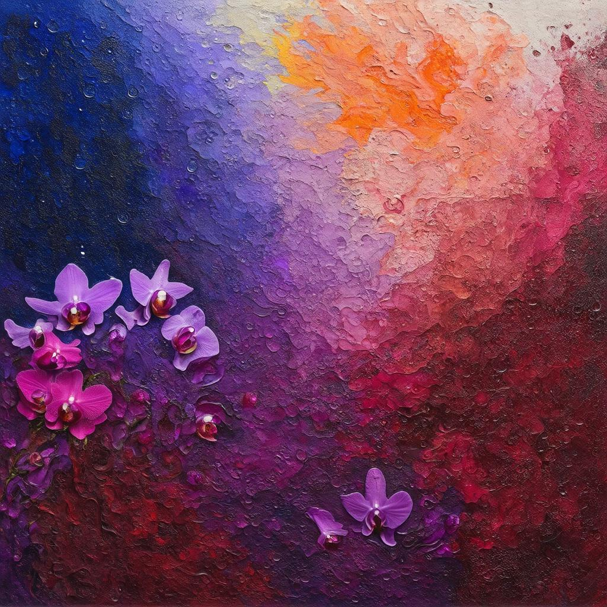 
 
 

Van Gogh: 

 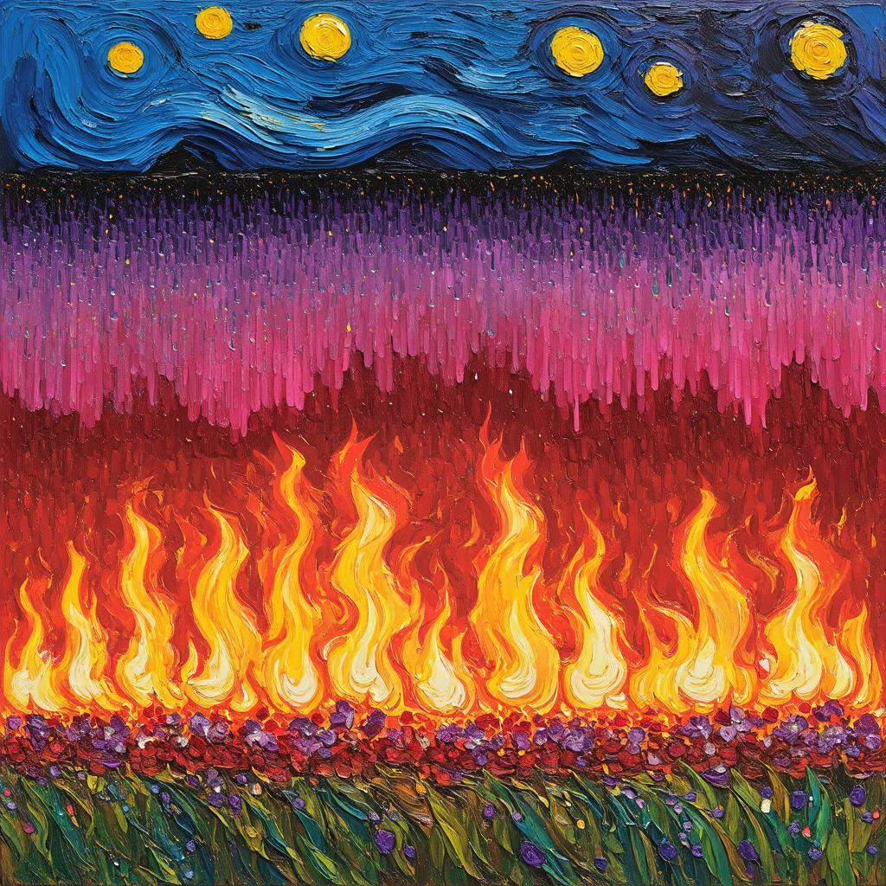 
 
 

 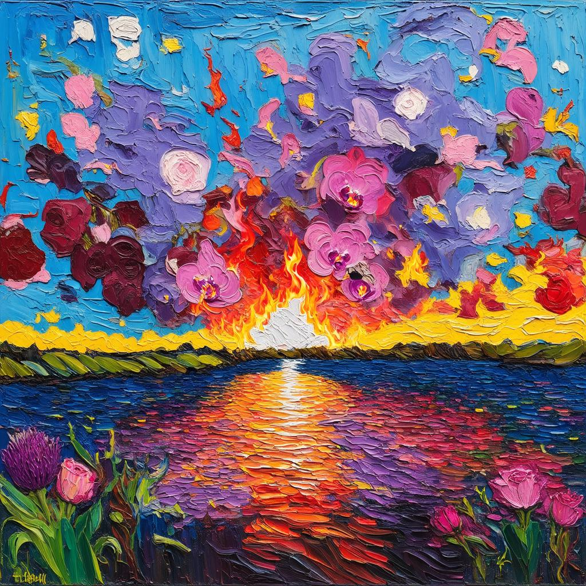 
 
 

Impressionism: 

 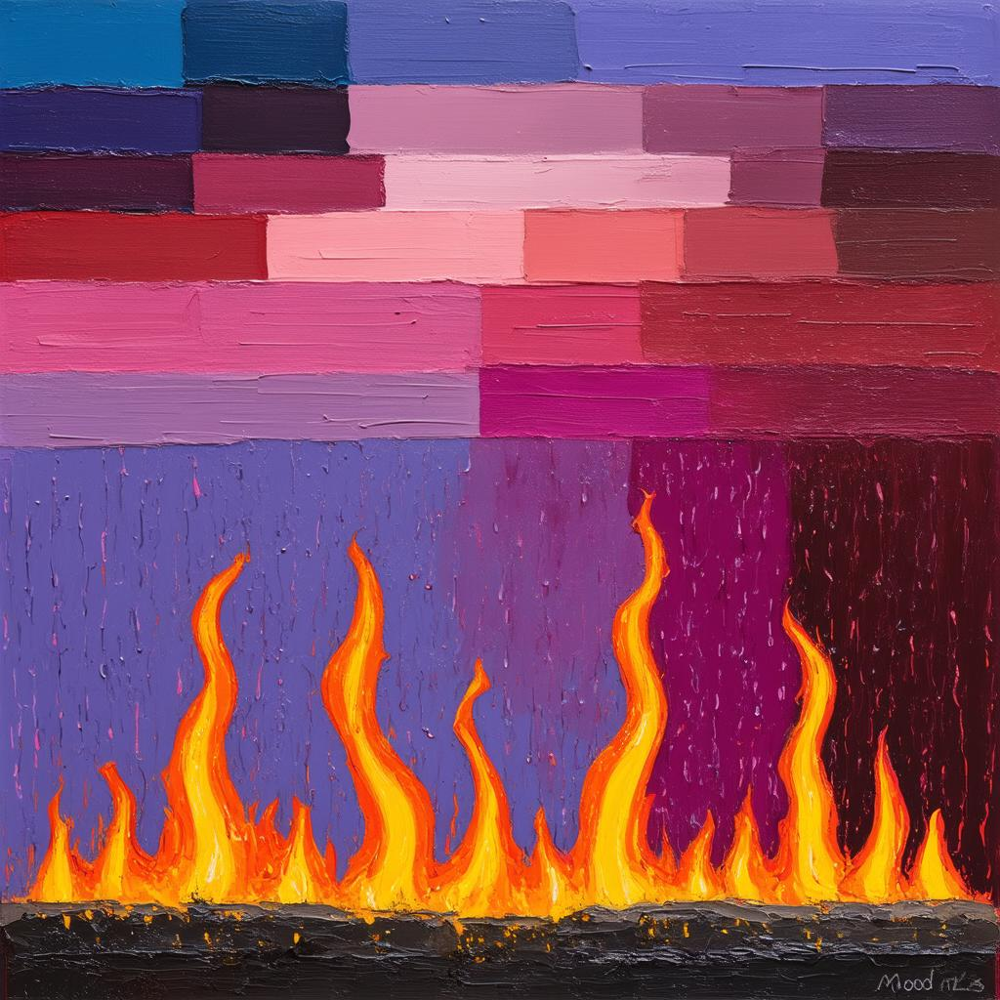 
 
 

I attempted one final run of playing "Set Fire to the Rain" using Impressionism as the style. The prompt specified, "Art Nouveau-like artwork where FIRE meets RAIN with the following features."

 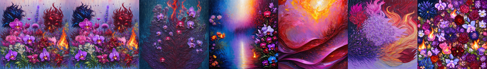 
 
 

  <a href="SetFireToTheRain/setfiretotherain12_artnouveau/captured_audio.wav">Audio</a>

## Final Thoughts 

The project was a lot of fun, even though it didn’t fully produce the outcome I had envisioned. If I had more time, I would have focused on perfecting the integration of lyrics into the images. I also would have dedicated an entire run to the Van Gogh style, as it turned out to be my favorite in hindsight.

Additionally, I wanted to incorporate some music theory into the color definitions, as suggested by a classmate during the final presentation. While I ultimately didn’t have enough time to explore this idea, I think it’s a great direction for further development.

Looking ahead, it could also be interesting to implement a video feature, transforming the project into a moving visual experience rather than just static images.

Disclaimer: ChatGPT was used to comment and debug code and refine the text.
