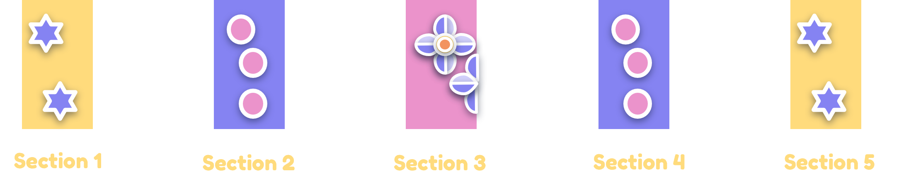
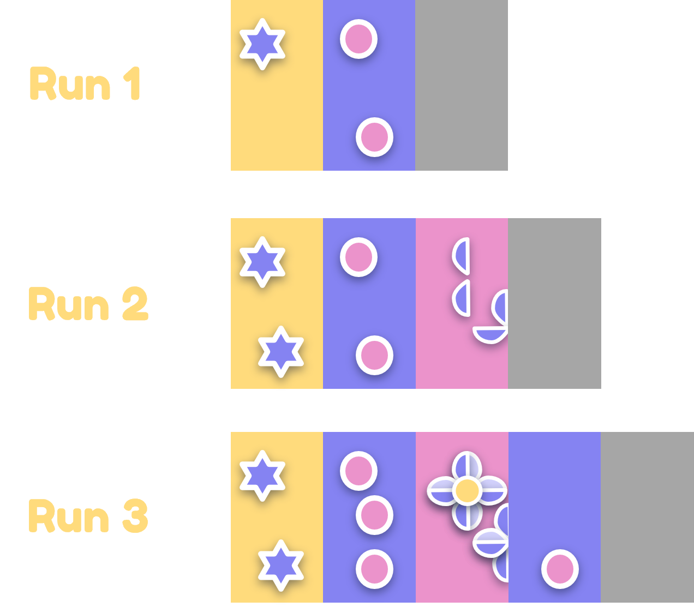
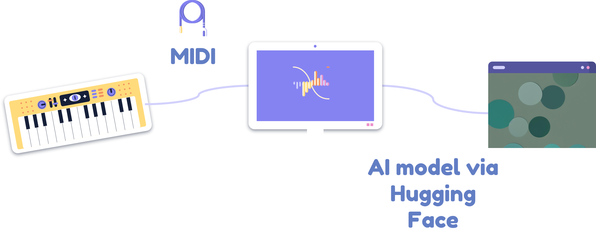

# DigCre_Project

This is the readme file for a project in the module **Digital Creativity** at Lucerne University of Applied Sciences and Arts. The goal of this project is to visualize piano learning progress using AI-generated images based on MIDI data captured from piano practice sessions. The fi

---

## Idea

This project uses MIDI data recorded during piano practice to create visual representations of learning progress. The data captured from the MIDI is used to define unique prompts based on what was played. To capture the "process," each run of playing the same song is split into defined sections. This is because, as a beginner, I tend to restart the song if I make a mistake. 

The more sections I play in a run, the more familiar I am with the song. It’s important to note that this idea is not meant to measure the quality of piano playing but rather the progress of learning the song. The song can be played completely wrong—as long as more notes are pressed, it still counts as "progress."

  

---

## Implementation

The project implementation involves capturing MIDI data from a keyboard, processing the data for visualization, and using an AI model to create the images. The e-piano or keyboard if first conntected to a computer via a midi cable. A python script will capture the midi data and transform the information into a readable promt for an AI model. The model i accessed via hugging face and passed the prompt. The AI then gives back the generated image. 

### Segmenting the Data 

The function "segment_midi_data" from the [midi_capture.py](Python%20Code/Prototype/midi_capture.py) segments MIDI data into smaller sections, each containing a specified number of notes (default is 8 in the prototype). It processes the input list of notes, where each note has pitch, velocity, and timestamp values. For each section, it collects notes until it reaches the specified size or the end of the input. Once a section is complete, it calculates features like pitch range, average velocity, tempo, rhythm complexity, note density, and the dominant octave based on the collected notes. These features provide insights into the musical structure of each section. After calculating the features, the section is stored, and the process repeats for the remaining notes until all data is processed.

This can be changed depending on the desired number of generated pictures and the amount of notes in a song. 

### Defining Prompts 

The function "generate_prompt" from the [prompt_generator.py](Python%20Code/Prototype/prompt_generator.py) generates a descriptive prompt for visualizing MIDI data based on the musical features extracted from a segment. It analyzes the tempo, velocity, pitch, and rhythmic complexity to determine mood, intensity, color schemes, and textures.

The tempo defines whether the mood is calm, balanced, or energetic. Velocity influences color intensity, with softer velocities leading to pastel tones and higher velocities producing bolder colors. The average pitch selects the dominant color scheme, transitioning from cool blues to warm yellows as pitch increases. Finally, rhythmic complexity determines the texture—simpler patterns for low complexity and intricate designs for higher values.

### Generating the Image 
The file [image_generator.py](Python%20Code/Prototype/image_generator.py) defines a function, generate_image, that sends a text prompt to the HuggingFace API for generating an image using the Stable Diffusion model. The function handles retries and errors, ensuring robustness against temporary unavailability of the model.

It sends a POST request to the API with the provided prompt and authorization header. If the request is successful, the image is processed directly from the response content and saved with the given filename.

If the API responds with a 503 status code, indicating that the model is still loading, the function waits for 60 seconds before retrying, allowing the server time to become available. It retries up to 5 times before giving up.

---

## First Iteration

- Captured MIDI data from basic piano exercises.
- Used simple AI models to generate abstract images.
- Tested various visualization styles to understand what works best.

### Code Files
The following code files are part of this iteration:

1. [midi_capture.py](Python%20Code/midi_capture.py) - Script for capturing MIDI data.
2. [image_generator.py](Python%20Code/image_generator.py) - AI model for generating images.
3. [data_processing.py](Python%20Code/data_processing.py) - Preprocessing MIDI data for visualization.

---

## Second Iteration

- Improved data preprocessing to include velocity and timing nuances.
- Experimented with different AI visualization tools to create more expressive and detailed images.
- Added comparisons to show how progress evolves over time.

